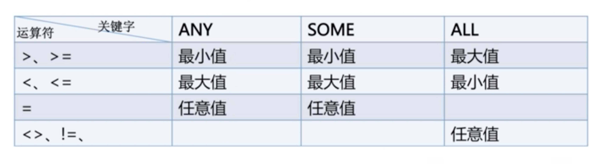
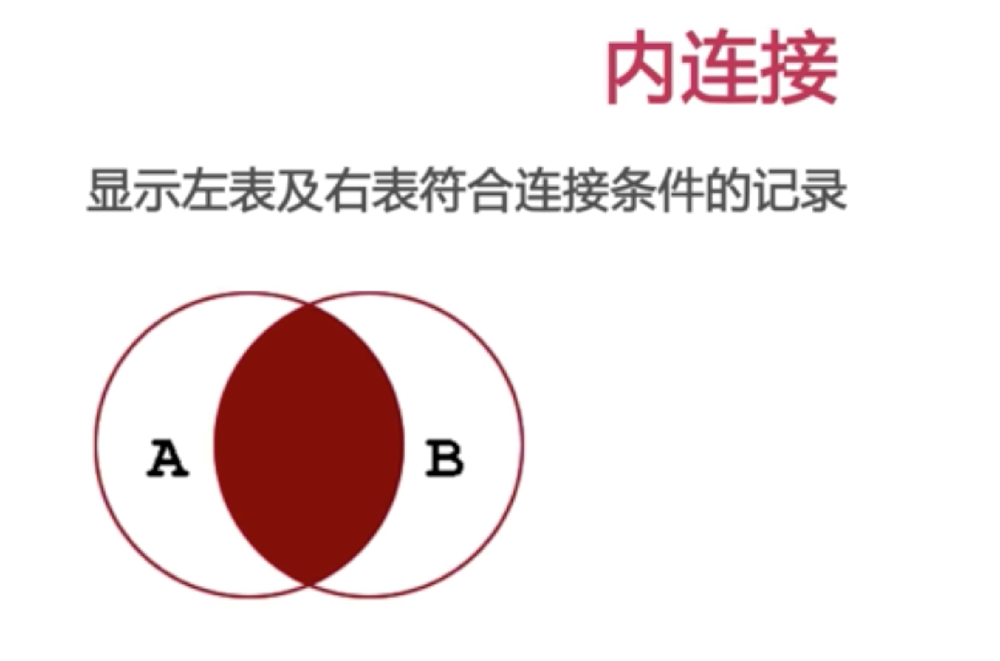
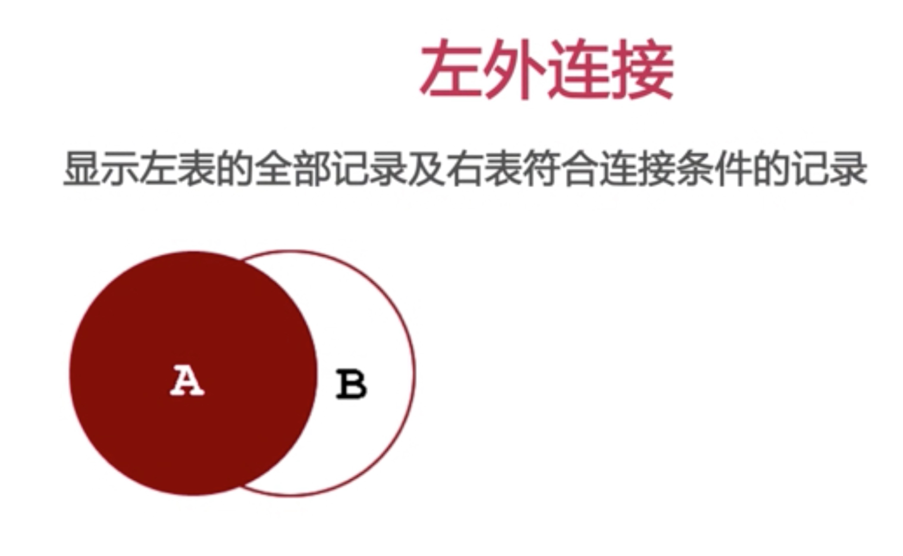
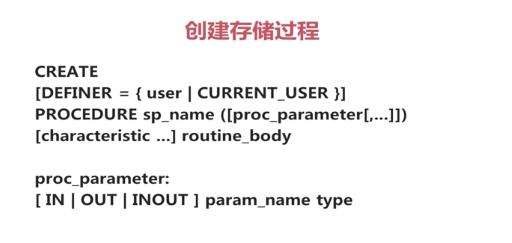
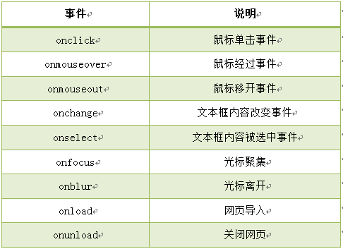
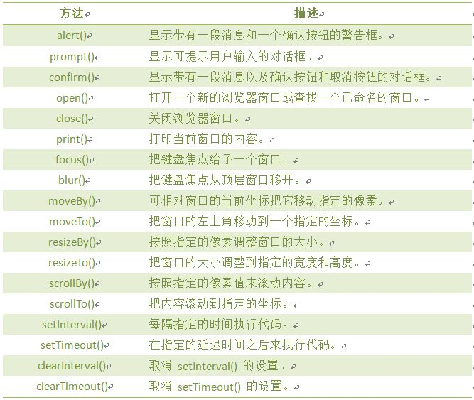
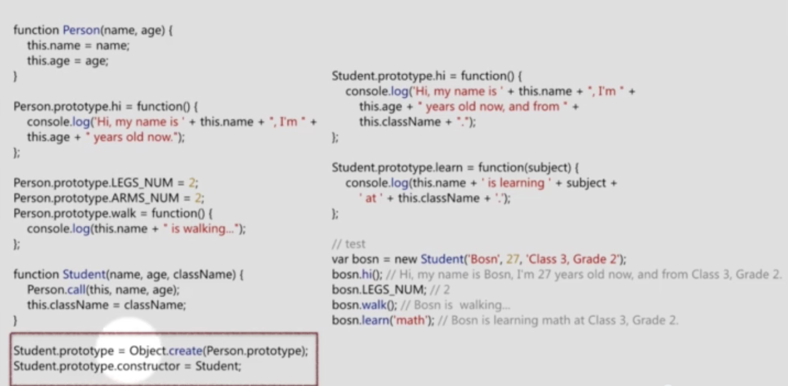
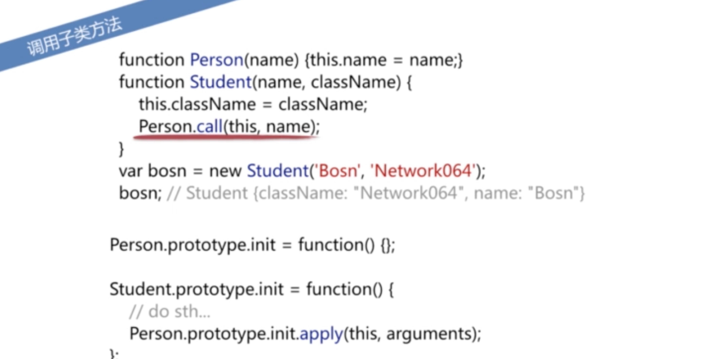
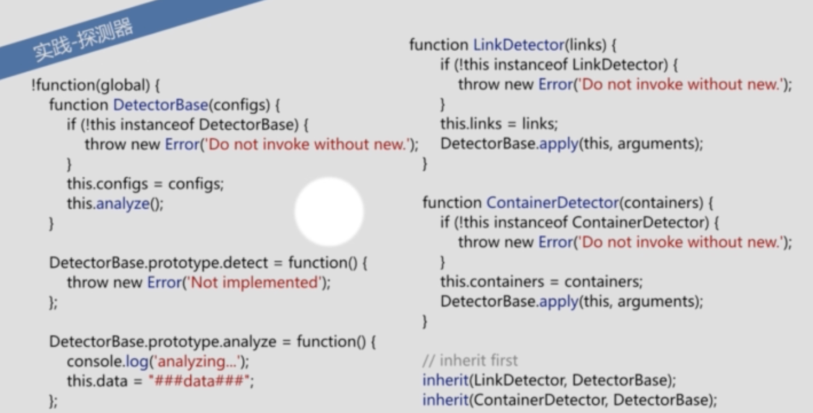
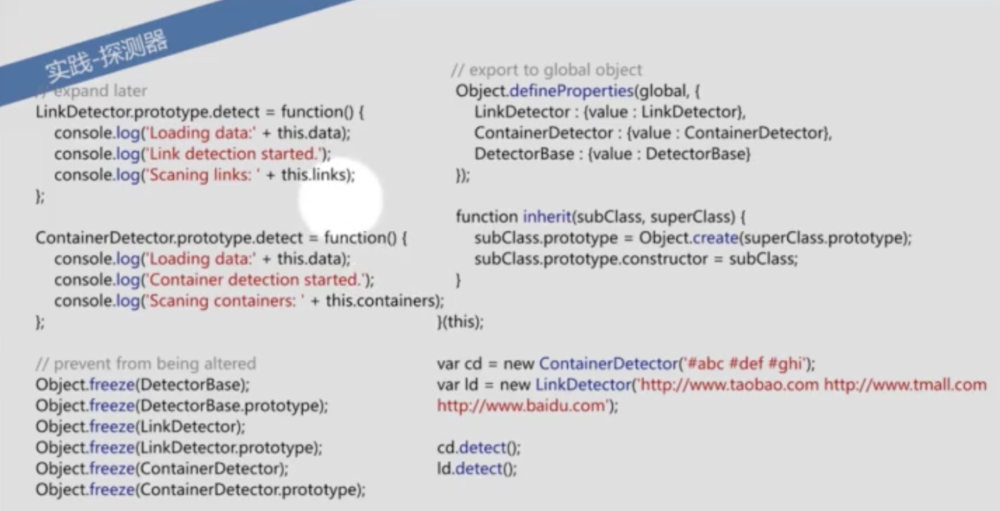

# ATA
AshToArt
## 一些学习，工作中积累下来的东西
* 关于一些项目的端口管理：
* API使用go语言web框架beego开发，分配端口9090
* Web使用js语言web框架anjurlar和vue，jade开发，分配端口8080
* Component使用php语言socket框架workerman开发，分配端口10000以上
* wechat使用js语言node.js+mongoDB开发，分配端口7070
* admin使用python，分配端口80

##2016.09.03
* 有关于php异步操作的东西:
> 有数据持久化支持（就是把队列保存到数据库介质中，那故障恢复也好做），有群集支持（其实很多××MQ都有这些功能）。PECL上有扩展，也有纯PHP实现扩展。反正这个Gearman也活了很久了，杂七杂八的问题都基本上解决了。
* 什么是worker:
> [关于Web Worker你必须知道的7件事](http://blog.csdn.net/dojotoolkit/article/details/25030289)
* gearman
> [基本思路](http://my.oschina.net/wakanoc/blog/101789)
* 线程与进程：
> 线程和进程的区别在于，子进程和父进程有不同的代码和数据空间，而多个线程则共享数据空间，每个线程有自己的执行堆栈和程序计数器为其执行上下文。多线程主要是为了节约CPU时间，发挥利用，根据具体情况而定。线程的运行中需要使用计算机的内存资源和CPU。
* 线程与进程的区别归纳：
>a.地址空间和其它资源：进程间相互独立，同一进程的各线程间共享。某进程内的线程在其它进程不可见。
b.通信：进程间通信IPC，线程间可以直接读写进程数据段（如全局变量）来进行通信——需要进程同步和互斥手段的辅助，以保证数据的一致性。
c.调度和切换：线程上下文切换比进程上下文切换要快得多。
d.在多线程OS中，进程不是一个可执行的实体。
* socket
>socket是应用层与TCP/IP协议族通信的中间软件抽象层，它是一组接口。在设计模式中，Socket其实就是一个门面模式，它把复杂的TCP/IP协议族隐藏在Socket接口后面，对用户来说，一组简单的接口就是全部，让Socket去组织数据，以符合指定的协议。
* kafka:
>kafka对消息保存时根据Topic进行归类，发送消息者成为Producer,消息接受者成为Consumer,此外kafka集群有多个kafka实例组成，每个实例(server)成为broker。无论是kafka集群，还是producer和consumer都依赖于zookeeper来保证系统可用性集群保存一些meta信息。
* 在遍历数组并且正则匹配数组中的每一个元素的时候
<!-- php -->
	$content = '土豆丝';
	$menu = ['西红柿炒鸡蛋', '土豆丝', '回锅肉'];
	
	for ($i = 0; $i < count($menu); $i++) {
		 print_r($menu[$i]);
		 var_dump(preg_match('/' . $menu[$i] . '/', $content));
		 echo '<br>';
	}

输出结果：
<!---->
	西红柿炒鸡蛋int(0) 
	土豆丝int(1) 
	回锅肉int(0) 
然而：
<!---->
	foreach ($menu as $k => $val) {
		print_r($val);
		var_dump(preg_match('/' . $val . '/', $content));
		echo '<br>';
	}
输出结果：
<!---->
	西红柿炒鸡蛋int(0) 
	土豆丝int(0) 
	回锅肉int(0) 
* Oauth2.0
> （A）用户打开客户端以后，客户端要求用户给予授权。
> 
>（B）用户同意给予客户端授权。
>
>（C）客户端使用上一步获得的授权，向认证服务器申请令牌。
>
>（D）认证服务器对客户端进行认证以后，确认无误，同意发放令牌。
>
>（E）客户端使用令牌，向资源服务器申请获取资源。
>
>（F）资源服务器确认令牌无误，同意向客户端开放资源。<br>
><br><font color=red>客户端授权模式</font><br><br>
>客户端必须得到用户的授权（authorization grant），才能获得令牌（access token）。OAuth 2.0定义了四种授权方式。<br> 
> * <font color=red>授权码模式</font>（authorization code）<br>
> * <font color=red>简化模式</font>（implicit）<br>
> * <font color=red>密码模式</font>（resource owner password credentials）<br>
> * <font color=red>客户端模式</font>（client credentials）<br>
<br>
><font color=red>授权码模式</font><br><br>
>（A）用户访问客户端，后者将前者导向认证服务器。<br>
>（B）用户选择是否给予客户端授权。<br>
>（C）假设用户给予授权，认证服务器将用户导向客户端事先指定的"重定向URI"（redirection URI），同时附上一个授权码。<br>
>（D）客户端收到授权码，附上早先的"重定向URI"，向认证服务器申请令牌。这一步是在客户端的后台的服务器上完成的，对用户不可见。<br>
>（E）认证服务器核对了授权码和重定向URI，确认无误后，向客户端发送访问令牌（access token）和更新令牌（refresh token）。<br>
* css 的三种模型
>流动模型
>
>浮动模型
>
>层模型
* 块级元素：
<!---->
	1. 每个元素都不在同一行，可以设置宽高，可以使用style=inline来变成内联元素
	2.内联元素都在同一行，不能设置宽高
	3.内联块状元素 style=inline-block，在同一行，并且能够设置宽高
* margin 和 padding
<!---->
	margin是在边框外，padding是在边框里
* 流动模型
<!---->
	第一点，块状元素都会在所处的包含元素内自上而下按顺序垂直延伸分布，因为在默认状态下，块状元素的宽度都为100%。实际上，块状元素都会以行的形式占据位置。如右侧代码编辑器中三个块状元素标签(div，h1，p)宽度显示为100%。
	第二点，在流动模型下，内联元素都会在所处的包含元素内从左到右水平分布显示。（内联元素可不像块状元素这么霸道独占一行
* 浮动模型
<!---->
	div{
    	width:200px;
    	height:200px;
    	border:2px red solid;
    	float:left;
	}
	<div id="div1"></div>
	<div id="div2"></div>
* 层模型有三种形式：
<!---->
	1、绝对定位(position: absolute)
	相对于其最接近的一个具有定位属性的父包含块进行绝对定位。如果不存在这样的包含块，则相对于body元素，即相对于浏览器窗口。
	2、相对定位(position: relative)
	相对于以前的位置移动，移动的方向和幅度由left、right、top、bottom属性确定，偏移前的位置保留不动。
	ex:
	#div1{
    	width:200px;
    	height:200px;
    	border:2px red solid;
    	position:relative;
    	left:100px;
    	top:50px;
	}
	
	<div id="div1"></div>
	3、固定定位(position: fixed)
	可以让滚动条滚的时候，元素块的位置不变
* 定位大法好
<!---->
	1、参照定位的元素必须是相对定位元素的前辈元素：

	<div id="box1"><!--参照定位的元素-->
    	<div id="box2">相对参照元素进行定位</div><!--相对定位元素-->
	</div>
	从上面代码可以看出box1是box2的父元素（父元素当然也是前辈元素了）。

	2、参照定位的元素必须加入position:relative;

		#box1{
    		width:200px;
    		height:200px;
    		position:relative;        
		}
	3、定位元素加入position:absolute，便可以使用top、bottom、left、right来进行偏移定位了。

		#box2{
    		position:absolute;
    		top:20px;
    		left:30px;         
		}
	这样box2就可以相对于父元素box1定位了（这里注意参照物就可以不是浏览器了，而可以自由设置了）。
* 不定宽度的块状元素有三种方法居中（这三种方法目前使用的都很多）：
<!---->
	1.加入 table 标签
	2.设置 display: inline 方法：与第一种类似，显示类型设为 行内元素，进行不定宽元素的属性设置
	第二种方法：改变块级元素的 display 为 inline 类型（设置为 行内元素 显示），然后使用 text-align:center 来实现居中效果。如下例子：
	<style>
	.container{
    	text-align:center;
	}
	/* margin:0;padding:0（消除文本与div边框之间的间隙）*/
	.container ul{
    	list-style:none;
    	margin:0;
    	padding:0;
    	display:inline;
	}
	/* margin-right:8px（设置li文本之间的间隔）*/
	.container li{
   	 	margin-right:8px;
    	display:inline;
	}
	</style>
	3.设置 position:relative 和 left:50%：利用 相对定位 的方式，将元素向左偏移 50% ，即达到居中的目的
	方法三：通过给父元素设置 float，然后给父元素设置 position:relative 和 left:50%，子元素设置 position:relative 和 left: -50% 来实现水平居中。
	<body>
	<div class="container">
    <ul>
        <li><a href="#">1</a></li>
        <li><a href="#">2</a></li>
        <li><a href="#">3</a></li>
    </ul>
	</div>
	</body>
	css代码：

	<style>
	.container{
    	float:left;
    	position:relative;
    	left:50%
	}

	.container ul{
    	list-style:none;
    	margin:0;
    	padding:0;
    
    	position:relative;
    	left:-50%;
	}
	.container li{float:left;display:inline;margin-right:8px;}
	</style>
* 清除浮动
<!---->
	clear属性-常用clear:both;(对紧邻的元素管用)
	同时设置width:100%;overflow:hidden
## 2016.09.06
* HTTP、WebSocket 等协议都是处于 OSI 模型的最高层： 应用层 。而 IP 协议工作在网络层（第3层），TCP 协议工作在传输层（第4层）。
* Socket是应用层与TCP/IP协议族通信的中间软件抽象层，它是一组接口。在设计模式中，Socket其实就是一个门面模式，它把复杂的TCP/IP协议族隐藏在Socket接口后面，对用户来说，一组简单的接口就是全部，让Socket去组织数据，以符合指定的协议。
* vue.js 入门
<!----->
	new Vue({
		data:{
			a:1,
			b:[]
		},
		methods:{
			doSomething:function(){
				this.a ++
			}
		},
		watch:{
			'a':function(val,oldVal){
				console.log(val,oldVal)
			},
		},
	})
	
<!---->
	//数据渲染
	<p>{{ a }}</p>
	<p v-text="a"></p>
	<p v-html="a"></p> 如果a里面有html的标签，那么该方法会编译成html的方法
<!---->
	<p v-if="到data"></p>
	<p v-if=""></p>
	<p v-for=""></p>
	<p v-on:click="到methods"></p>
	<p v-bind:class="到methods"></p>
<!---->
	// 如何控制class
	<template>
	v-bind:class="{finished:isFinished}"
	</template>
	<script>
	data: isFinished:true
	</script>
	<style>
	.finished{
		//css code
	}
	</style>
<!---->
	<button v-on:click="change()"></button>
	<input v-model="newItem" v-on:keyup.enter="add">
	<script>
		methods:{
			add(){
				this.newItem
			}
		}
	</script>
<!---->
	const STORAGE_KEY = 'todos'
	exports default{
		fetch:function(){
			return JSON.parse(window.localStorage.getItem(STORAGE_KEY) || '')
		},
		save:function (items){
			window.localStorage.setItem(STORAGE_KEY,JSON.stringify(items))
		}
	}
	
	
	
	
	
	
	//另一个
	<script>
		watch:{
			items:{
				handler:function(val,oldVal){
					
				},
				deep:true//如果为false表示无法修改items中一个单独的key
			}
		}
	</script>
<!---->
	//父组件通知儿子
	//父组件
	<child msgfromdad="laji"></child>
	
	//子组件
	<tp>{{ msgfromdad }}</tp>
	props:['msgfromdad']//这样才能读取父组件的msgfromdad
<!---->
	//子组件告知父亲
	//父组件
	<p>{{ childwords }}</p>
	<child v-on:child-tell-me="listenToMyBoy"></child> //v-on可以任何事件名
	methods:{
		listenToMyBoy:function(msg){
			this.childwords = msg //这里的childwords需要在data:里面注册一下哟
		}
	}
	
	//子组件
	methods:{
		some:funciont(){
			this.$emit('child-tell-me','hahahahah')
		}
	}
<!---->
	子$dispatch 
	父events{
		'child-tell-me':function(msg){
			this.childWords = msg
		}
	}
	
	父$broadcast
	子events
##2016.09.11
* socket多线程的主要逻辑整理
	
	第一步首先需要去循环调用accept来监听客户端的请求，然后服务端接受客户端的socket，并且特别注意是<font color=red>服务端创立一个专门的socket来处理这个客户端的socket</font>

##2016.09.12
* 进程之间的通信，线程之间的通信
* hadoop spark
* memercache和redis

	1.redis支持更丰富的数据结构  hash  string  list set sorted set   memcache
	
	2.mem对简单的key-value的形式存储的内存利用率更高
	
	3.redis 单核，存储小数据性能更高，mem多核，存储大量数据的性能会更好
* python爬虫
* laravel5.1
* sql分区，索引

	左边是数据表，一共有两列七条记录，最左边的是数据记录的物理地址（注意逻辑上相邻的记录在磁盘上也并不是一定物理相邻的）。为了加快Col2的查找，可以维护一个右边所示的二叉查找树，每个节点分别包含索引键值和一个指向对应数据记录物理地址的指针，这样就可以运用二叉查找在O(log2n)的复杂度内获取到相应数据。

	创建索引可以大大提高系统的性能。<br>
第一，通过创建唯一性索引，可以保证数据库表中每一行数据的唯一性。
第二，可以大大加快数据的检索速度，这也是创建索引的最主要的原因。
第三，可以加速表和表之间的连接，特别是在实现数据的参考完整性方面特别有意义。
第四，在使用分组和排序子句进行数据检索时，同样可以显著减少查询中分组和排序的时间。
第五，通过使用索引，可以在查询的过程中，使用优化隐藏器，提高系统的性能。 

	在创建索引的时候，应该考虑在哪些列上可以创建索引，在哪些列上不能创建索引。一般来说，应该在这些列上创建索引：在经常需要搜索的列上，可以加快搜索的速度；在作为主键的列上，强制该列的唯一性和组织表中数据的排列结构；在经常用在连接的列上，这些列主要是一些外键，可以加快连接的速度；在经常需要根据范围进行搜索的列上创建索引，因为索引已经排序，其指定的范围是连续的；在经常需要排序的列上创建索引，因为索引已经排序，这样查询可以利用索引的排序，加快排序查询时间；在经常使用在WHERE子句中的列上面创建索引，加快条件的判断速度。
	
	当修改性能远远大于检索性能时，不应该创建索引。这是因为，修改性能和检索性能是互相矛盾的。当增加索引时，会提高检索性能，但是会降低修改性能。当减少索引时，会提高修改性能，降低检索性能。因此，当修改性能远远大于检索性能时，不应该创建索引。

	根据数据库的功能，可以在数据库设计器中创建三种索引：唯一索引、主键索引和聚集索引
	
		唯一索引 
唯一索引是不允许其中任何两行具有相同索引值的索引。
当现有数据中存在重复的键值时，大多数数据库不允许将新创建的唯一索引与表一起保存。数据库还可能防止添加将在表中创建重复键值的新数据。例如，如果在employee表中职员的姓(lname)上创建了唯一索引，则任何两个员工都不能同姓。
主键索引
数据库表经常有一列或列组合，其值唯一标识表中的每一行。该列称为表的主键。
在数据库关系图中为表定义主键将自动创建主键索引，主键索引是唯一索引的特定类型。该索引要求主键中的每个值都唯一。当在查询中使用主键索引时，它还允许对数据的快速访问。
聚集索引
在聚集索引中，表中行的物理顺序与键值的逻辑（索引）顺序相同。一个表只能包含一个聚集索引。
如果某索引不是聚集索引，则表中行的物理顺序与键值的逻辑顺序不匹配。与非聚集索引相比，聚集索引通常提供更快的数据访问速度。

* 钩子函数
* swoole和workerman
* put  delete用什么变量接受下来

<!---->	
	
	$type = $_SERVER['REQUEST_METHOD'];
	parse_str(file_get_contents('php://input'), $data);
	$data = array_merge($_GET, $_POST, $data);
	//根据 $type 的值做相应的操作
##2016.09.15
* 数据库

	当使用group by 并且带着 having子句的时候，我们需要保证两个条件，1.having后面应该为一个聚合函数（count avg  max min sum）。2.having后面的待条件的字段需要出现在我们select后面的字段
* insert

	INSERT test(username) SELECT username FROM users WHERE age > 30  //将查询的结果写入到数据表
* 子查询

	出现在其他SQL语句内的select子句，子查询是指嵌套在查询内部的查询，始终出现在圆括号内，子查询可以包含多个关键字或者条件，如DISTINCT,GROUP BY,LIMIT等等，子查询的外层查询一般多为 SELECT UPDATE SET DO等等，子查询的返回结果可以是标量，一行，一列，或者子查询   
* rand(avg(xxx),2)小数点后面保留两位
* ANY SOME ALL 

	
* IN 和 NOT IN 引发的子查询
* 多表更新 
	
	内连接：
	
	
	UPDATE tdb_goods INNER_JOIN tdb_goods_cates ON goods_cate = cate_name SET goods_cate = cate_id
	外连接（左）：
	
	
	比如左边表的链接的话，就会查出所有左边表的数据
* 其实表的链接可以看成是一种外键的你想操作，外键和数据分开了存储，通过“链接”我们又将多张表联系在一起
* 单表连接

	type_id    type_name    parent_id
	   1         电器             0
	   2         大家电   		  1
	   3         小家电           1
	   4         电视             2
	   5         手电筒           3
	
	SELECT s.type_id,s.type_name,p.type_name FROM goods_types AS s LEFT JOIN goods_types AS p ON s.parent_id = p.parent_id
	
	如果一张表需要显示父类下的子类的数目只需要加上简单的分组就行
	
	
	SELECT p.type_id,p.type_name,s.type_name FROM tdb_goods_type AS p IN tdb_goods_type AS s ON s.parent_id = p.type_id GROUP BY p.type_name
	
	
	
	SELECT p.type_id,p.type_name,count(s.type_name) AS  child_count FROM tdb_goods_type AS p LEFT JOIN tdb_goods_type AS s ON p.parent_id = s.type_id GROUP BY p.type_name ORDER BY p.type_id
* sql语句中like关键字

	如果需要查询诸如需要通配符的情况，比如需要查找tom%这种字符串里面包含%的结果，那么应该怎么查询呢，应该把如果写成 “LIKE '%%%'”则会查出全部非空结果，所以必须写成“LIKE '%1%%%'”去告诉体统中间的%不需要作为通配符出现，%代表任意个字符，_代表任意一个字符
	
	
	
	
##2016.09.17
* php 多线程，处理一个异步操作的任务

	希望在Web这边获取一种方式，来执行一个长达数小时的“异步”任务。就PHP而言，可以用2种方式来做：
（1）在PHP里使用shell_exec的函数，以shell的方式，启动一个独立的PHP脚本执行。这种方式，其实相当于在Web服务器处理过程中，独立起了一个shell进程处理你的任务。这里，需要特别注意的是shell_exec的服务器安全，注意校验参数，小心避免被带入shell命令中。这个是比较容易实现的方式。
（2）使用PHP实现一个Server，监听一个端口，为Web端提供服务。这里的实现方式有很多，通常要配合扩展，例如原生的pthread（多线程），开源扩展swoole等等。

	直接在web程序里使用多线程，是不恰当的，web请求通常有时间限制，例如timeout默认是30秒。你如何保证，在线程任务执行完之前，它的父进程仍然在工作？
* go 语言闭包

<!--lang:golang-->
	package main

	import "fmt"

	func adder() func(int) int {
	     sum := 0
	     return func(x int) int {
	          sum += x
	          return sum
	     }
	}

	func main() {
	     pos, neg := adder(), adder()
	     for i := 0; i < 10; i++ {
	          fmt.Println(
	               pos(i),
	               neg(-2*i),
	          )
	     }
	}
	
	运行返回结果：
	0 0
	1 -2
	3 -6
	6 -12
	10 -20
	15 -30
	21 -42
	28 -56
	36 -72
	45 -90

这个就是Go中的闭包，一个函数和与其相关的引用环境组合而成的实体。

 

关于闭包的概念《闭包的概念、形式和应用》一文已经说的很清楚了。

 

个人理解： 

其实理解闭包的最方便的方法就是将闭包函数看成一个类，一个闭包函数调用就是实例化一个类。

然后就可以根据类的角度看出哪些是“全局变量”，哪些是“局部变量”了。

比如上例中的adder函数返回func(int) int 的函数

pos和neg分别实例化了两个“闭包类”，在这个“闭包类”中有个“闭包全局变量”sum。所以这样就很好理解返回的结果了。

* php 闭包

匿名函数

提到闭包就不得不想起匿名函数，也叫闭包函数（closures），貌似PHP闭包实现主要就是靠它。声明一个匿名函数是这样：


	$func = function() {
    
	}; //带结束符
可以看到，匿名函数因为没有名字，如果要使用它，需要将其返回给一个变量。匿名函数也像普通函数一样可以声明参数，调用方法也相同：


	$func = function( $param ) {
    	echo $param;
	};

	$func( 'some string' );

	//输出：
	//some string

顺便提一下，PHP在引入闭包之前，也有一个可以创建匿名函数的函数：create function，但是代码逻辑只能写成字符串，这样看起来很晦涩并且不好维护，所以很少有人用。

 

实现闭包

将匿名函数在普通函数中当做参数传入，也可以被返回。这就实现了一个简单的闭包。

下边有三个例子

	//例一
	//在函数里定义一个匿名函数，并且调用它
	function printStr() {
    	$func = function( $str ) {
       	 	echo $str;
    	};
    	$func( 'some string' );
	}

	printStr();


<!---->
	//例二
	//在函数中把匿名函数返回，并且调用它
	function getPrintStrFunc() {
    	$func = function( $str ) {
        	echo $str;
    	};
    	return $func;
	}

	$printStrFunc = getPrintStrFunc();
	$printStrFunc( 'some string' );


<!---->

	//例三
	//把匿名函数当做参数传递，并且调用它
	function callFunc( $func ) {
    	$func( 'some string' );
	}

	$printStrFunc = function( $str ) {
    	echo $str;
	};
	callFunc( $printStrFunc );

	//也可以直接将匿名函数进行传递。如果你了解js，这种写法可能会很熟悉
	callFunc( function( $str ) {
    	echo $str;
	});

 

连接闭包和外界变量的关键字：USE

闭包可以保存所在代码块上下文的一些变量和值。PHP在默认情况下，匿名函数不能调用所在代码块的上下文变量，而需要通过使用use关键字。

换一个例子看看：

	function getMoney() {
    	$rmb = 1;
    	$dollar = 6;
    	$func = function() use ( $rmb ) {
        	echo $rmb;
        	echo $dollar;
    	};
    	$func();
	}

	getMoney();

	//输出：
	//1
	//报错，找不到dorllar变量
可以看到，dollar没有在use关键字中声明，在这个匿名函数里也就不能获取到它，所以开发中要注意这个问题。

有人可能会想到，是否可以在匿名函数中改变上下文的变量，但我发现是不可以的：

	function getMoney() {
    	$rmb = 1;
    	$func = function() use ( $rmb ) {
        	echo $rmb;
        	//把$rmb的值加1
        	$rmb++;
    	};
    	$func();
    	echo $rmb;
	}

	getMoney();

	//输出：
	//1
	//1
啊，原来use所引用的也只不过是变量的一个副本而已。但是我想要完全引用变量，而不是复制。

要达到这种效果，其实在变量前加一个 & 符号就可以了：

	function getMoney() {
    	$rmb = 1;
    	$func = function() use ( &$rmb ) {
        	echo $rmb;
        	//把$rmb的值加1
        	$rmb++;
    	};
    	$func();
    	echo $rmb;
	}

	getMoney();

	//输出：
	//1
	//2
好，这样匿名函数就可以引用上下文的变量了。如果将匿名函数返回给外界，匿名函数会保存use所引用的变量，而外界则不能得到这些变量，这样形成‘闭包’这个概念可能会更清晰一些。

根据描述改变一下上面的例子：

	function getMoneyFunc() {
    	$rmb = 1;
    	$func = function() use ( &$rmb ) {
        	echo $rmb;
        	//把$rmb的值加1
        	$rmb++;
    	};
    	return $func;
	}

	$getMoney = getMoneyFunc();
	$getMoney();
	$getMoney();
	$getMoney();

	//输出：
	//1
	//2
	//3

 

总结

PHP闭包的特性并没有太大惊喜，其实用CLASS就可以实现类似甚至强大得多的功能，更不能和js的闭包相提并论，只能期待PHP以后对闭包支持的改进。不过匿名函数还是挺有用的，比如在使用preg_replace_callback等之类的函数可以不用在外部声明回调函数了。

* 存储过程
	
	存储过程是SQL语句和控制语句的预编译集合，以一个名称存储并作为一个单元处理
	比如，以前写两个sql语句，那么mysql的引擎会对这两个sql语句逐一进行语法分析，逐一进行编译，再逐一的执行，而在我们使用了存储过程之后，只有在第一次才进行语法分析和编译，以后客户端直接调用编译的结果就可以了
	
	创建存储过程
	
	
	
* 带有in类型的存储过程

	DELIMITER//
	CREATE PROCEDURE xxxxx(IN p_id INT UNSIGNED)
	BEGIN
	xxxx FROM xxx WHERE id = p_id;
	END
* 带有in和out类型的存储过程

	DELIMITER//
	CREATE PROCEDURE xxxxx(IN p_id INT UNSIGNED，OUT numbs INT UNSIGNED)
	BEGIN
	xxxx FROM xxx WHERE id = p_id;
	SELECT FROM xxx INTO numbs
	END
* javascript

	
	
	
	
##2016.09.19
* new Object()和Object.create()的区别
<!--lang:javascript-->
	// Demo
	var a = new Object();  // 创建一个对象，没有父类哦
 
	var b = Object.create(a.prototype);  // b 继承了a的原型
	
第一种：
<!--lang:javascript-->
	var a = {x:1};
	var b = Object.create(a);
	console.log(b);//输出：{};
	console.log(b.__proto__);//输出：{x:1}

第二种：
<!--lang:javascript-->
	//如果用 
	b =new object(a)
	connsole.log(b);//输出：{x:1}
	congsole.log(b.__proto__);//输出：{}
只要注意区分\__proto__和prototype就可以了，所以 
<!---->
	var b = Object.create(a.prototype); // b 继承了a的原型
这个说法是错误的，应该是b.\__proto__=== a.prototype,严格等于
结论：b的原型指向a的prototype属性



* 实例--探测器





##2016.10.17
###sql之left join、right join、inner join的区别

left join(左联接) 返回包括左表中的所有记录和右表中联结字段相等的记录 
right join(右联接) 返回包括右表中的所有记录和左表中联结字段相等的记录
inner join(等值连接) 只返回两个表中联结字段相等的行

* 举例如下：

表A记录如下：
aID　　　　　aNum
1　　　　　a20050111
2　　　　　a20050112
3　　　　　a20050113
4　　　　　a20050114
5　　　　　a20050115

表B记录如下:
bID　　　　　bName
1　　　　　2006032401
2　　　　　2006032402
3　　　　　2006032403
4　　　　　2006032404
8　　　　　2006032408

-

* 1.left join
sql语句如下: 
select * from A
left join B 
on A.aID = B.bID

结果如下:
aID　　　　　aNum　　　　　bID　　　　　bName
1　　　　　a20050111　　　　1　　　　　2006032401
2　　　　　a20050112　　　　2　　　　　2006032402
3　　　　　a20050113　　　　3　　　　　2006032403
4　　　　　a20050114　　　　4　　　　　2006032404
5　　　　　a20050115　　　　NULL　　　　　NULL

（所影响的行数为 5 行）
结果说明:
left join是以A表的记录为基础的,A可以看成左表,B可以看成右表,left join是以左表为准的.
换句话说,左表(A)的记录将会全部表示出来,而右表(B)只会显示符合搜索条件的记录(例子中为: A.aID = B.bID).

B表记录不足的地方均为NULL.

-

* 2.right join
sql语句如下: 
select * from A
right join B 
on A.aID = B.bID

结果如下:
aID　　　　　aNum　　　　　bID　　　　　bName
1　　　　　a20050111　　　　1　　　　　2006032401
2　　　　　a20050112　　　　2　　　　　2006032402
3　　　　　a20050113　　　　3　　　　　2006032403
4　　　　　a20050114　　　　4　　　　　2006032404
NULL　　　　　NULL　　　　　8　　　　　2006032408

（所影响的行数为 5 行）
结果说明:
仔细观察一下,就会发现,和left join的结果刚好相反,这次是以右表(B)为基础的,A表不足的地方用NULL填充.

-

* 3.inner join

sql语句如下: 
select * from A
innerjoin B 
on A.aID = B.bID

结果如下:
aID　　　　　aNum　　　　　bID　　　　　bName
1　　　　　a20050111　　　　1　　　　　2006032401
2　　　　　a20050112　　　　2　　　　　2006032402
3　　　　　a20050113　　　　3　　　　　2006032403
4　　　　　a20050114　　　　4　　　　　2006032404

结果说明:
很明显,这里只显示出了 A.aID = B.bID的记录.这说明inner join并不以谁为基础,它只显示符合条件的记录.

-
注: 
LEFT JOIN操作用于在任何的 FROM 子句中，组合来源表的记录。使用 LEFT JOIN 运算来创建一个左边外部联接。左边外部联接将包含了从第一个（左边）开始的两个表中的全部记录，即使在第二个（右边）表中并没有相符值的记录。

语法：FROM table1 LEFT JOIN table2 ON table1.field1 compopr table2.field2

说明：table1, table2参数用于指定要将记录组合的表的名称。
field1, field2参数指定被联接的字段的名称。且这些字段必须有相同的数据类型及包含相同类型的数据，但它们不需要有相同的名称。
compopr参数指定关系比较运算符："="， "<"， ">"， "<="， ">=" 或 "<>"。
如果在INNER JOIN操作中要联接包含Memo 数据类型或 OLE Object 数据类型数据的字段，将会发生错误. 	

##2016.10.18
* mysql 数据库索引优化

```sql
SELECT * FROM payment WHERE staff_id = 2 AND customer_id = 584;
```
由于customer\_id的离散度更大，所以应该使用index(customer\_id,staff\_id)
需要查询字段的离散程度，离散度越大的列应该放在联合索引的前面

```sql
select count (distinct customer_id),count (distinct staff_id) from 
```
某一列的唯一值越多，说明其离散程度越好，可选择性更好


*注意：索引会影响写入效率


* php安装扩展

以前以为php的扩展要重新编译php，今天在群友的指点下知道可以像apache模块一样动态扩展，以mcrypt举例。
进入要安装的扩展的源码目录

	cd /root/php-5.2.6/ext/mcrypt
	
运行

	phpize
	
	Configuring for:
	PHP Api Version:         20041225
	Zend Module Api No:      20060613
	Zend Extension Api No:   220060519
 
出现这样的提示说明可以扩展。
 
然后编译安装
	
	./configure --with-php-config=/usr/local/php5/bin/php-config 
	make
	make install
=	
	/usr/local/php5/lib/php/extensions/no-debug-non-zts-20060613/
记住这里提示的路径刚才编译的module就在这里

	cd /usr/local/php5/lib/php/extensions/no-debug-non-zts-20060613/
	no-debug-non-zts-20060613 $ls

	eaccelerator.so  mcrypt.so  memcache.so

然后编辑php.ini（如果php安装在/usr/local/php5 则php.ini在/usr/local/php5/lib/php.ini中添加

	extension_dir = "/usr/local/php5/lib/php/extensions/no-debug-non-zts-20060613/"
	extension = "mcrypt.so"

然后重启apache，然后再访问phpinfo.php 就看到支持mcrypt了。

##2016.10.20
###mac 一般使用bash作为默认shell

Mac系统的环境变量，加载顺序为：

	/etc/profile 
	/etc/paths 
	~/.bash_profile 
	~/.bash_login 
	~/.profile 
	~/.bashrc

当然/etc/profile和/etc/paths是系统级别的，系统启动就会加载，后面几个是当前用户级的环境变量。后面3个按照从前往后的顺序读取，如果~/.bash_profile文件存在，则后面的几个文件就会被忽略不读了，如果~/.bash_profile文件不存在，才会以此类推读取后面的文件。~/.bashrc没有上述规则，它是bash shell打开的时候载入的。

如果没特殊说明,设置PATH的语法都为：

     export PATH=$PATH:<PATH 1>:<PATH 2>:<PATH 3>:------:<PATH N>

（一）全局设置
下面的几个文件设置是全局的，修改时需要root权限

1）/etc/paths （全局建议修改这个文件 ）
编辑 paths，将环境变量添加到 paths文件中 ，一行一个路径
Hint：输入环境变量时，不用一个一个地输入，只要拖动文件夹到 Terminal 里就可以了。

2）/etc/profile （建议不修改这个文件 ）
全局（公有）配置，不管是哪个用户，登录时都会读取该文件。

3）/etc/bashrc （一般在这个文件中添加系统级环境变量）
全局（公有）配置，bash shell执行时，不管是何种方式，都会读取此文件。

4）
1.创建一个文件：

	sudo touch /etc/paths.d/mysql
2.用 vim 打开这个文件（如果是以 open -t 的方式打开，则不允许编辑）：

	sudo vim /etc/paths.d/mysql
3.编辑该文件，键入路径并保存（关闭该 Terminal 窗口并重新打开一个，就能使用 mysql 命令了）

	/usr/local/mysql/bin
据说，这样可以自己生成新的文件，不用把变量全都放到 paths 一个文件里，方便管理。

（二）单个用户设置

	1）~/.bash_profile （任意一个文件中添加用户级环境变量）
（注：Linux 里面是 .bashrc 而 Mac 是 .bash_profile）
若bash shell是以login方式执行时，才会读取此文件。该文件仅仅执行一次!默认情况下,他设置一些环境变量
设置命令别名
	
	alias ll=’ls -la’
设置环境变量：

	export PATH=/opt/local/bin:/opt/local/sbin:$PATH
2）~/.bashrc 同上

如果想立刻生效，则可执行下面的语句：
	
	$ source 相应的文件
一般环境变量更改后，重启后生效。
##2016.10.21
###使用php多进程和IPC以及异步操作的研究
* php进程间通信使用的是消息队列或者信号量与内存共享

<font style="color:red">消息队列</font>使用设计模式中的消费者生产者模式，然后使用fork出一个子进程，然后生成出的子进程，先产生生产者进程，然后去产生消费者进程，生产者进程往进程中增加一些消息，通过msg\_send 方法，可以实现将需要传递的数据线扔到缓存中，然后产生消费者进程通过msg\_receive 实现从缓存中读取数据的方法；关于<font style="color:red">共享内存</font>，应该是最快速的ipc，它的主要实现原理是映射一段能被其他进程所访问到的内存，这段内存由一个进程创建，多进程都可以访问

php的异步操作所使用的方案是gearman或者yield关键字，目前在为PHP安装gearman扩展的过程中出现的问题是缺少boost，boost现在在brew install 一键安装的时候，出现了问题报错目前未解决，不过现在已经拥有了gearman的源码包，并且workerman和swoole都纷纷使用了gearman

##2016.10.24
###laravel中的容器和请求实例
首先Laravel框架捕获到用户发到public\index.php的请求，生成Illuminate\Http\Request实例，传递给这个小小的handle方法。在方法内部，将该<font color="red">$request实例绑定到第二步生成的$app容器上</font>。让后在该请求真正处理之前，调用bootstrap方法，进行必要的加载和注册，如检测环境，加载配置，注册Facades（假象），注册服务提供者，启动服务提供者等等。

* 服务容器

服务容器就是一个普通的容器，用来装类的实例，然后在需要的时候再取出来。用更专业的术语来说是服务容器实现了控制反转（Inversion of Control，缩写为IoC），意思是正常情况下类A需要一个类B的时候，我们需要自己去new类B，意味着我们必须知道类B的更多细节，比如构造函数，随着项目的复杂性增大，这种依赖是毁灭性的。控制反转的意思就是，将类A主动获取类B的过程颠倒过来变成被动，类A只需要声明它需要什么，然后由容器提供。

* 事件绑定

* 依赖注入

传统的思路是应用程序用到一个Foo类，就会创建Foo类并调用Foo类的方法，假如这个方法内需要一个Bar类，就会创建Bar类并调用Bar类的方法，而这个方法内需要一个Bim类，就会创建Bim类，接着做些其它工作。

```php
	// 代码【1】
    class Bim
    {
        public function doSomething()
        {
            echo __METHOD__, '|';
        }
    }
    
    class Bar
    {
        public function doSomething()
        {
            $bim = new Bim();
            $bim->doSomething();
            echo __METHOD__, '|';
        }
    }
    
    class Foo
    {
        public function doSomething()
        {
            $bar = new Bar();
            $bar->doSomething();
            echo __METHOD__;
        }
    }
    
    $foo = new Foo();
    $foo->doSomething(); //Bim::doSomething|Bar::doSomething|Foo::doSomething
```

使用依赖注入的思路是应用程序用到Foo类，Foo类需要Bar类，Bar类需要Bim类，那么先创建Bim类，再创建Bar类并把Bim注入，再创建Foo类，并把Bar类注入，再调用Foo方法，Foo调用Bar方法，接着做些其它工作。

```php
	// 代码【2】
    class Bim
    {
        public function doSomething()
        {
            echo __METHOD__, '|';
        }
    }
    
    class Bar
    {
        private $bim;
    
        public function __construct(Bim $bim)
        {
            $this->bim = $bim;
        }
    
        public function doSomething()
        {
            $this->bim->doSomething();
            echo __METHOD__, '|';
        }
    }
    
    class Foo
    {
        private $bar;
    
        public function __construct(Bar $bar)
        {
            $this->bar = $bar;
        }
    
        public function doSomething()
        {
            $this->bar->doSomething();
            echo __METHOD__;
        }
    }
    
    $foo = new Foo(new Bar(new Bim()));
    $foo->doSomething(); // Bim::doSomething|Bar::doSomething|Foo::doSomething
```

这就是控制反转模式。依赖关系的控制反转到调用链的起点。这样你可以完全控制依赖关系，通过调整不同的注入对象，来控制程序的行为。例如Foo类用到了memcache，可以在不修改Foo类代码的情况下，改用redis。

使用依赖注入容器后的思路是应用程序需要到Foo类，就从容器内取得Foo类，容器创建Bim类，再创建Bar类并把Bim注入，再创建Foo类，并把Bar注入，应用程序调用Foo方法，Foo调用Bar方法，接着做些其它工作.

总之容器负责实例化，注入依赖，处理依赖关系等工作。

* 代码演示

```php
	class Container
    {
        private $s = array();
    
        function __set($k, $c)
        {
            $this->s[$k] = $c;
        }
    
        function __get($k)
        {
            return $this->s[$k]($this);
        }
    }
```

这段代码使用了魔术方法，在给不可访问属性赋值时，__set() 会被调用。读取不可访问属性的值时，__get() 会被调用。

```php
	$c = new Container();
    
    $c->bim = function () {
        return new Bim();
    };
    $c->bar = function ($c) {
        return new Bar($c->bim);
    };
    $c->foo = function ($c) {
        return new Foo($c->bar);
    };
    
    // 从容器中取得Foo
    $foo = $c->foo;
    $foo->doSomething(); // Bim::doSomething|Bar::doSomething|Foo::doSomething
```
这段代码使用了匿名函数

再来一段简单的代码演示一下

```php
 class IoC
    {
        protected static $registry = [];
    
        public static function bind($name, Callable $resolver)
        {
            static::$registry[$name] = $resolver;
        }
    
        public static function make($name)
        {
            if (isset(static::$registry[$name])) {
                $resolver = static::$registry[$name];
                return $resolver();
            }
            throw new Exception('Alias does not exist in the IoC registry.');
        }
    }
    
    IoC::bind('bim', function () {
        return new Bim();
    });
    IoC::bind('bar', function () {
        return new Bar(IoC::make('bim'));
    });
    IoC::bind('foo', function () {
        return new Foo(IoC::make('bar'));
    });
    
    
    // 从容器中取得Foo
    $foo = IoC::make('foo');
    $foo->doSomething(); // Bim::doSomething|Bar::doSomething|Foo::doSomething
```

这段代码使用了后期静态绑定

* 依赖注入容器的高级功能

1.自动绑定或者自动解析
2.注释解析器
3.延迟注入

```php
class Bim
    {
        public function doSomething()
        {
            echo __METHOD__, '|';
        }
    }
    
    class Bar
    {
        private $bim;
    
        public function __construct(Bim $bim)
        {
            $this->bim = $bim;
        }
    
        public function doSomething()
        {
            $this->bim->doSomething();
            echo __METHOD__, '|';
        }
    }
    
    class Foo
    {
        private $bar;
    
        public function __construct(Bar $bar)
        {
            $this->bar = $bar;
        }
    
        public function doSomething()
        {
            $this->bar->doSomething();
            echo __METHOD__;
        }
    }
    
    class Container
    {
        private $s = array();
    
        public function __set($k, $c)
        {
            $this->s[$k] = $c;
        }
    
        public function __get($k)
        {
            // return $this->s[$k]($this);
            return $this->build($this->s[$k]);
        }
    
        /**
         * 自动绑定（Autowiring）自动解析（Automatic Resolution）
         *
         * @param string $className
         * @return object
         * @throws Exception
         */
        public function build($className)
        {
            // 如果是匿名函数（Anonymous functions），也叫闭包函数（closures）
            if ($className instanceof Closure) {
                // 执行闭包函数，并将结果
                return $className($this);
            }
    
            /** @var ReflectionClass $reflector */
            $reflector = new ReflectionClass($className);
    
            // 检查类是否可实例化, 排除抽象类abstract和对象接口interface
            if (!$reflector->isInstantiable()) {
                throw new Exception("Can't instantiate this.");
            }
    
            /** @var ReflectionMethod $constructor 获取类的构造函数 */
            $constructor = $reflector->getConstructor();
    
            // 若无构造函数，直接实例化并返回
            if (is_null($constructor)) {
                return new $className;
            }
    
            // 取构造函数参数,通过 ReflectionParameter 数组返回参数列表
            $parameters = $constructor->getParameters();
    
            // 递归解析构造函数的参数
            $dependencies = $this->getDependencies($parameters);
    
            // 创建一个类的新实例，给出的参数将传递到类的构造函数。
            return $reflector->newInstanceArgs($dependencies);
        }
    
        /**
         * @param array $parameters
         * @return array
         * @throws Exception
         */
        public function getDependencies($parameters)
        {
            $dependencies = [];
    
            /** @var ReflectionParameter $parameter */
            foreach ($parameters as $parameter) {
                /** @var ReflectionClass $dependency */
                $dependency = $parameter->getClass();
    
                if (is_null($dependency)) {
                    // 是变量,有默认值则设置默认值
                    $dependencies[] = $this->resolveNonClass($parameter);
                } else {
                    // 是一个类，递归解析
                    $dependencies[] = $this->build($dependency->name);
                }
            }
    
            return $dependencies;
        }
    
        /**
         * @param ReflectionParameter $parameter
         * @return mixed
         * @throws Exception
         */
        public function resolveNonClass($parameter)
        {
            // 有默认值则返回默认值
            if ($parameter->isDefaultValueAvailable()) {
                return $parameter->getDefaultValue();
            }
    
            throw new Exception('I have no idea what to do here.');
        }
    }
    
    // ----
    $c = new Container();
    $c->bar = 'Bar';
    $c->foo = function ($c) {
        return new Foo($c->bar);
    };
    // 从容器中取得Foo
    $foo = $c->foo;
    $foo->doSomething(); // Bim::doSomething|Bar::doSomething|Foo::doSomething
    
    // ----
    $di = new Container();
    
    $di->foo = 'Foo';
    
    /** @var Foo $foo */
    $foo = $di->foo;
    
    var_dump($foo);
    /*
    Foo#10 (1) {
      private $bar =>
      class Bar#14 (1) {
        private $bim =>
        class Bim#16 (0) {
        }
      }
    }
    */
    
    $foo->doSomething(); // Bim::doSomething|Bar::doSomething|Foo::doSomething
```
以上代码的原理参考PHP官方文档：反射，PHP 5 具有完整的反射 API，添加了对类、接口、函数、方法和扩展进行反向工程的能力。 此外，反射 API 提供了方法来取出函数、类和方法中的文档注释。

若想进一步提供一个数组访问接口，如$di->foo可以写成$di'foo']，则需用到[ArrayAccess（数组式访问）接口 。

一些复杂的容器会有许多特性，下面列出一些相关的github项目，欢迎补充。

##2016.11.2
###安装php7 mongoDB扩展

* 如果在php/bin目录下有pecl install 那么可以一键安装pecl install mongodb

* 如果没有，那么你需要源码编译安装
	
	首先你需要在[mongodb-php扩展](https://pecl.php.net/package/mongodb)下载一个mongodb的源码包
	
	然后
	
		tar -zxvf mongodb-xxx.tgz
    	cd mongodb-xxx
    	phpize
    	./configure --with-php-config=/xxx/php-config --with-openssl-dir = /usr/local/Cellar/openssl/xxxx
    	make && make install
    最后，在php.ini中加入扩展extension=mongodb.so，可以使用php -i|grep php.ini来定位到php.ini绝对路径

###mongoDB 中的 capped collections
Capped collections 就是固定大小的collection。
它有很高的性能以及队列过期的特性(过期按照插入的顺序). 有点和 "RRD" 概念类似。
Capped collections是高性能自动的维护对象的插入顺序。它非常适合类似记录日志的功能 和标准的collection不同，你必须要显式的创建一个capped collection， 指定一个collection的大小，单位是字节。collection的数据存储空间值提前分配的。
要注意的是指定的存储大小包含了数据库的头信息。

	db.createCollection("mycoll", {capped:true, size:100000})

* 在capped collection中，你能添加新的对象。
* 能进行更新，然而，对象不会增加存储空间。如果增加，更新就会失败 。
* 数据库不允许进行删除。使用drop()方法删除collection所有的行。
* 注意: 删除之后，你必须显式的重新创建这个collection。
在32bit机器中，capped collection最大存储为1e9( 1X109)个字节。

##2016.11.8
###go语言的空接口强制类型转换

* 循环使用反射来处理
* 如果要是转换成字典需要unsafe

##2016.11.10
###socket聊天室的思路

用户登录时，握手等，以流的形式处理，三个数组或者list来存储流数据，一个作为处理主进程的，处理握手，处理登录，一个作为处理读数据的，一个作为写数据的，

##2016.12.8
###数据库架构

最好不要在主库上进行数据备份，大型活动前取消这类计划
mysql不支持多CPU的并发运算，所以对数据库来说，一条sql执行10ms和100ms是有天壤之别的
大量的并发量，数据库的连接数被占满
数据库问题其实主要的问题就是sql慢查询的问题和磁盘IO的问题

##2017.1.10
###go语言支持IPC的方法

IPC的意思是Interprocess Communication 
IPC有三种  基于通讯  基于信号  基于同步
基于通讯有两种 数据传送  共享内存
数据传送有两种 管道 消息队列 => 管道用来传送字节流  消息队列传送结构化的数据
go语言支持的IPC主要是管道、信号、Socket

##2017.2.15
###进程的衍生

如果进程的父进程挂了，子进程不会中断而是被祖先进程（即内核启动进程“收养”）成为它的直接进程

##2017.2.23
###什么是进程描述符

进程描述符并不是一个简单的符号，而是一个非常复杂的数据结构，记录了进程的优先级，状态，虚拟地址范围以及各种访问权限
进程描述符不仅仅包含有自己的操作系统中的唯一标识符PID，还包含其父进程的PPID

##2017.3.9
###进程的标识

PID并不传达与进程有关的任何信息，PPID一样，但是PPID确实体现了两个进程之间的亲缘关系，我们可以利用这一点来找到守护进程

##2017.3.13
###进程的状态

每个进程在不同时刻都有可能会有不同的状态，这些进程的状态一共可以分成6个
1.可运行状态：将要运行在CPU上
2.可中断的睡眠状态：当进程正在等待某个事件的时候，会被放在对应事件的等待队列中
3.不可中断的睡眠状态：不会对任何信号做出响应
4.暂停状态或者跟踪状态：向进程发送SIGSTOP的状态，就会进入暂停状态，向暂停状态的进程发送SIGCONT信号会使得该进程转向可运行状态
5.僵尸状态：即将结束，绝大多数资源被回收，有一些信息未删除
6.退出状态：当一个进程消亡的时候，内核会给其父进程发送一个SIGCHLD信号以告知此情况

##2017.3.20
###go语言的http请求
golang要请求远程网页，可以使用net/http包中的client提供的方法实现。查看了官方网站有一些示例，没有太全面的例子，于是自己整理了一下。

get请求

get请求可以直接http.Get方法，非常简单。

func httpGet() {
    resp, err := http.Get("http://www.01happy.com/demo/accept.php?id=1")
    if err != nil {
        // handle error
    }
 
    defer resp.Body.Close()
    body, err := ioutil.ReadAll(resp.Body)
    if err != nil {
        // handle error
    }
 
    fmt.Println(string(body))
}
post请求

一种是使用http.Post方式

func httpPost() {
    resp, err := http.Post("http://www.01happy.com/demo/accept.php",
        "application/x-www-form-urlencoded",
        strings.NewReader("name=cjb"))
    if err != nil {
        fmt.Println(err)
    }
 
    defer resp.Body.Close()
    body, err := ioutil.ReadAll(resp.Body)
    if err != nil {
        // handle error
    }
 
    fmt.Println(string(body))
}
Tips：使用这个方法的话，第二个参数要设置成”application/x-www-form-urlencoded”，否则post参数无法传递。

一种是使用http.PostForm方法

func httpPostForm() {
    resp, err := http.PostForm("http://www.01happy.com/demo/accept.php",
        url.Values{"key": {"Value"}, "id": {"123"}})
 
    if err != nil {
        // handle error
    }
 
    defer resp.Body.Close()
    body, err := ioutil.ReadAll(resp.Body)
    if err != nil {
        // handle error
    }
 
    fmt.Println(string(body))
 
}
复杂的请求

有时需要在请求的时候设置头参数、cookie之类的数据，就可以使用http.Do方法。


func httpDo() {
    client := &http.Client{}
 
    req, err := http.NewRequest("POST", "http://www.01happy.com/demo/accept.php", strings.NewReader("name=cjb"))
    if err != nil {
        // handle error
    }
 
    req.Header.Set("Content-Type", "application/x-www-form-urlencoded")
    req.Header.Set("Cookie", "name=anny")
 
    resp, err := client.Do(req)
 
    defer resp.Body.Close()
 
    body, err := ioutil.ReadAll(resp.Body)
    if err != nil {
        // handle error
    }
 
    fmt.Println(string(body))
}
同上面的post请求，必须要设定Content-Type为application/x-www-form-urlencoded，post参数才可正常传递。

如果要发起head请求可以直接使用http client的head方法，比较简单

## 2017.4.7
### Redis list 之增删改查
一、增加

1、lpush [lpush key valus...]  类似于压栈操作，将元素放入头部

```ssh
127.0.0.1:6379> lpush plist ch0 ch1 ch2
(integer) 3
127.0.0.1:6379> lrange plist 0 3
1) "ch2"
2) "ch1"
3) "ch0"
127.0.0.1:6379> lpush plist ch4
(integer) 4
127.0.0.1:6379> lrange plist 0 4
1) "ch4"
2) "ch2"
3) "ch1"
4) "ch0"
```

2 、lpushx [lpushx key valus]:只能插入已经存在的key,且一次只能插入一次

```ssh
127.0.0.1:6379> lpushx pl ch
(integer) 0
127.0.0.1:6379> lpushx plist ch5 ch6
(error) ERR wrong number of arguments for 'lpushx' command
127.0.0.1:6379> lpushx plist ch5
(integer) 5
127.0.0.1:6379> lrange plist 0 5
1) "ch5"
2) "ch4"
3) "ch2"
4) "ch1"
5) "ch0"
```

3、rpush  [rpush key valus...] ：将元素push在list的尾部

```ssh
127.0.0.1:6379> rpush plist ch6
(integer) 6
127.0.0.1:6379> lrange plist 0 6
1) "ch5"
2) "ch4"
3) "ch2"
4) "ch1"
5) "ch0"
6) "ch6"
127.0.0.1:6379> rpush plist ch7 ch8
(integer) 8
127.0.0.1:6379> lrange plist 0 8
1) "ch5"
2) "ch4"
3) "ch2"
4) "ch1"
5) "ch0"
6) "ch6"
7) "ch7"
8) "ch8"
```

4、rpushx [rpushx key valus...] :相对于lpushx

5、linsert [linsert key before/after pivot value]:将值插入到pivot的前面或后面。返回列表元素个数。如果参照点pivot不存在不插入。如果有多个pivot，以离表头最近的为准

```ssh
127.0.0.1:6379> linsert plist before ch1 chi
(integer) 9
127.0.0.1:6379> lrange plist 0 9
1) "ch5"
2) "ch4"
3) "ch2"
4) "chi"
5) "ch1"
6) "ch0"
7) "ch6"
8) "ch7"
9) "ch8"
127.0.0.1:6379> linsert plist before chii chi2
(integer) -1
127.0.0.1:6379> linsert plist after chi cha
(integer) 10
127.0.0.1:6379> lrange plist 0 10
 1) "ch5"
 2) "ch4"
 3) "ch2"
 4) "chi"
 5) "cha"
 6) "ch1"
 7) "ch0"
 8) "ch6"
 9) "ch7"
10) "ch8"
//以上插入操作均是返回list的长度
```


二、删除

1、lpop 、rpop：分别为删除头部和尾部，返回被删除的元素

```ssh
127.0.0.1:6379> lpop plist
"ch5"
127.0.0.1:6379> lrange plist 0 10
1) "ch4"
2) "ch2"
3) "chi"
4) "cha"
5) "ch1"
6) "ch0"
7) "ch6"
8) "ch7"
9) "ch8"
127.0.0.1:6379> rpop plist
"ch8"
127.0.0.1:6379> lrange plist 0 10
1) "ch4"
2) "ch2"
3) "chi"
4) "cha"
5) "ch1"
6) "ch0"
7) "ch6"
8) "ch7"
```

2 、ltrim [ltrim key  range_l range_r]:保留区域类的元素，其他的删除

```ssh
127.0.0.1:6379> ltrim plist 0 3
OK
127.0.0.1:6379> lrange plist 0 10
1) "ch4"
2) "ch2"
3) "chi"
4) "cha"
```

3、lrem [lrem key count value] :移除等于value的元素，当count>0时，从表头开始查找，移除count个；当count=0时，从表头开始查找，移除所有等于value的；当count<0时，从表尾开始查找，移除|count| 个。

cout >0

```ssh
127.0.0.1:6379> lrange plist 0 10
 1) "ch0"
 2) "ch0"
 3) "ch0"
 4) "ch4"
 5) "chi"
 6) "cha"
 7) "ch0"
 8) "ch0"
 9) "ch0"
10) "ch0"
127.0.0.1:6379> lrem plist 5 ch0
(integer) 5
127.0.0.1:6379> lrange plist 0 10
1) "ch4"
2) "chi"
3) "cha"
4) "ch0"
5) "ch0"
```

count <0

```ssh
127.0.0.1:6379> lrange plist 0 10
 1) "ch0"
 2) "ch9"
 3) "ch0"
 4) "ch0"
 5) "ch0"
 6) "ch4"
 7) "chi"
 8) "cha"
 9) "ch0"
10) "ch0"
127.0.0.1:6379> lrem plist -5 ch0
(integer) 5
127.0.0.1:6379> lrange plist 0 10
1) "ch0"
2) "ch9"
3) "ch4"
4) "chi"
5) "cha"
```

三、修改
lset [lset key index value] : 设置列表指定索引的值，如果指定索引不存在则报错

```ssh
127.0.0.1:6379> lset plist 0 ch2
OK
127.0.0.1:6379> lrange plist 0 10
1) "ch2"
2) "ch9"
3) "ch4"
4) "chi"
5) "cha"
```

四、查询
1、lindex [lindex key index]:通过索引index获取列表的元素、key>=0从头到尾，key<0从尾到头

```ssh
127.0.0.1:6379> lrange plist 0 10
1) "ch2"
2) "ch9"
3) "ch4"
4) "chi"
5) "cha"
127.0.0.1:6379> lindex plist 0
"ch2"
127.0.0.1:6379> lindex plist -0
"ch2"
127.0.0.1:6379> lindex plist -1
"cha"
127.0.0.1:6379> lindex plist 5
(nil)
```

2、lrange [lrange key range_l range_r]:0 表头、-1表尾

## 2017.04.10
### go语言redis redigo

* redis操作：
 
```golang
// tcp连接redis
 
  rs, err := redis.Dial("tcp", host)
 
  // 操作完后自动关闭 
 
  defer rs.Close()
 
 // 操作redis时调用Do方法，第一个参数传入操作名称（字符串），然后根据不同操作传入key、value、数字等
 // 返回2个参数，第一个为操作标识，成功则为1，失败则为0；第二个为错误信息
 value, err := redis.String(rs.Do("GET", key))
 if err != nil {
    fmt.Println("fail")
 }
 
 若value的类型为int，则用redis.Int转换
 
 若value的类型为string，则用redis.String转换
 
 若value的类型为json，则用redis.Byte转换
 
 // 存json数据
 key := "aaa"
 imap := map[string]string{"key1": "111", "key2": "222"}
 // 将map转换成json数据
 value, _ := json.Marshal(imap)
 // 存入redis
 n, err := rs.Do("SETNX", key, value)
 if err != nil {
     fmt.Println(err)
 }
 if n == int64(1) {
     fmt.Println("success")
 }
// 取json数据
// 先声明imap用来装数据
var imap map[string]string
key := "aaa"<br>// json数据在go中是[]byte类型，所以此处用redis.Bytes转换
value, err := redis.Bytes(rs.Do("GET", key))
if err != nil {
    fmt.Println(err)
}
// 将json解析成map类型
errShal := json.Unmarshal(value, &imap)
if errShal != nil {
    fmt.Println(err)
}
fmt.Println(imap["key1"])
fmt.Println(imap["key2"])
```

* 一个订阅发布功能

```golang
package models

import (
    "github.com/garyburd/redigo/redis"
    "github.com/astaxie/beego"
    "time"
    "fmt"
)

var (
    //定义常亮
    RedisClient *redis.Pool
    REDIS_HOST string
    REDIS_PORT string
    REDIS_DB int
)

func init() {
    //从配置文件中获取redis的ip以及db
    REDIS_HOST = beego.AppConfig.String("redis_host")
    REDIS_PORT = beego.AppConfig.String("redis_port")
    REDIS_DB = beego.AppConfig.DefaultInt("redis_db", 0)
    // 建立连接池
    RedisClient = &redis.Pool{
        // 从配置文件获取maxidle以及maxactive，取不到则用后面的默认值
        MaxIdle:     beego.AppConfig.DefaultInt("redis_maxidle", 100),
        MaxActive:   beego.AppConfig.DefaultInt("redis_maxactive", 1024),
        IdleTimeout: 180 * time.Second,
        Dial: func() (redis.Conn, error) {
            c, err := redis.Dial("tcp", REDIS_HOST+":"+REDIS_PORT)
            if err != nil {
                return nil, err
            }
            // 选择db
            //c.Do("SELECT", REDIS_DB)
            return c, nil
        },
    }
}

/**
 *redis订阅信息
 *
 */
func Subscribe() {
    c := RedisClient.Get()
    psc := redis.PubSubConn{c}
    psc.Subscribe("redChatRoom")

    defer func() {
        c.Close()
        psc.Unsubscribe("redChatRoom")　　//取消订阅
    } ()
    for {
        switch v := psc.Receive().(type) {
        case redis.Message:
            fmt.Printf("%s: messages: %s\n", v.Channel, v.Data)
        case redis.Subscription:
            //fmt.Printf("%s: %s %d\n", v.Channel, v.Kind, v.Count)
            continue
        case error:
            fmt.Println(v)
            return
        }
    }
}

/**
 *redis发布信息
 *
 */
func Pubscribe(s string) {
    c := RedisClient.Get()
    defer c.Close()

    _, err := c.Do("PUBLISH", "redChatRoom", s)
    if err != nil {
        fmt.Println("pub err: ", err)
        return
    }
}

func test() {
    // 从池里获取连接
    rc := RedisClient.Get()
    // 用完后将连接放回连接池
    defer rc.Close()
    //rc.Do()
    //n, _ := rc.Do("EXPIRE", key, 24*3600)  
    //value, err := redis.String(rs.Do("GET", key))
    return
}
```

## 2017.04.15
### go语言redigo存储struct的几个例子

* 例子1

```golang
package main

import (
    "github.com/garyburd/redigo/redis"
    "log"
)

func main() {
    conn, err := redis.Dial("tcp", ":6379")
    if err != nil {
        log.Fatalf("Couldn't connect to Redis: %v\n", err)
    }
    defer conn.Close()

    stockData := map[string]map[string]string{
        "GOOG": {"company_name": "Google Inc.", "open_price": "803.99", "ask_price": "795.50", "close_price": "802.66", "bid_price": "793.36"},
        "MSFT": {"ask_price": "N/A", "open_price": "28.30", "company_name": "Microsoft Corpora", "bid_price": "28.50", "close_price": "28.37"},
    }

    // Example 1: Write command arguments out explicitly.

    for sym, row := range stockData {
        if _, err := conn.Do("HMSET", sym,
            "company_name", row["company_name"],
            "open_price", row["open_price"],
            "ask_price", row["ask_price"],
            "bid_price", row["bid_price"]); err != nil {
            log.Fatal(err)
        }
    }

    printAndDel(conn, "example 1", stockData)

    // Example 2: Construct command arguments using range over a row map.

    for sym, row := range stockData {
        args := []interface{}{sym}
        for k, v := range row {
            args = append(args, k, v)
        }
        if _, err := conn.Do("HMSET", args...); err != nil {
            log.Fatal(err)
        }
    }

    printAndDel(conn, "example 2", stockData)

    // Example 3: Construct command arguments using Redigo helper function.

    for sym, row := range stockData {
        if _, err := conn.Do("HMSET", redis.Args{sym}.AddFlat(row)...); err != nil {
            log.Fatal(err)
        }
    }

    printAndDel(conn, "example 3", stockData)
}

func printAndDel(conn redis.Conn, message string, stockData map[string]map[string]string) {
    log.Print(message)
    for sym := range stockData {
        values, err := redis.Values(conn.Do("HGETALL", sym))
        if err != nil {
            log.Fatal(err)
        }
        log.Print(sym)
        for i := 0; i < len(values); i += 2 {
            log.Printf("  %s: %s", values[i], values[i+1])
        }
    }
    for sym := range stockData {
        if _, err := conn.Do("DEL", sym); err != nil {
            log.Fatal(err)
        }
    }
}
```
* 例子2

```golang
package main

import (
    "github.com/garyburd/redigo/redis"
    "log"
)

type Stock struct {
    CompanyName string `redis:"company_name"`
    OpenPrice   string `redis:"open_price"`
    AskPrice    string `redis:"ask_price"`
    ClosePrice  string `redis:"close_price"`
    BidPrice    string `redis:"bid_price"`
}

func main() {
    conn, err := redis.Dial("tcp", ":6379")
    if err != nil {
        log.Fatalf("Couldn't connect to Redis: %v\n", err)
    }
    defer conn.Close()

    stockData := map[string]*Stock{
        "GOOG": &Stock{CompanyName: "Google Inc.", OpenPrice: "803.99", AskPrice: "795.50", ClosePrice: "802.66", BidPrice: "793.36"},
        "MSFT": &Stock{AskPrice: "N/A", OpenPrice: "28.30", CompanyName: "Microsoft Corpora", BidPrice: "28.50", ClosePrice: "28.37"},
    }

    for sym, row := range stockData {
        if _, err := conn.Do("HMSET", redis.Args{sym}.AddFlat(row)...); err != nil {
            log.Fatal(err)
        }
    }

    for sym := range stockData {
        values, err := redis.Values(conn.Do("HGETALL", sym))
        if err != nil {
            log.Fatal(err)
        }
        var stock Stock
        if err := redis.ScanStruct(values, &stock); err != nil {
            log.Fatal(err)
        }
        log.Printf("%s: %+v", sym, &stock)
    }
}
```
